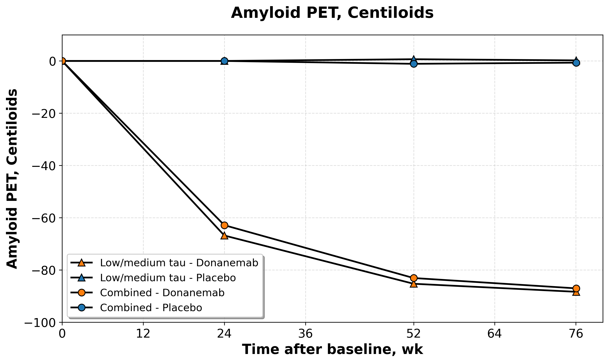

# Fitting_Lin_QSP

This repository will hold the revised version of our Lin et al 2022 QSP model reproduction as well as sources of data used to re-fit the model.

## Summary of Clinical Trial Data

The following table provides an overview of all anti-amyloid antibody clinical trial data included in this repository:

| Drug | Study Name | Phase | Reference | Data File | Measure | Conditions |
|------|------------|-------|-----------|-----------|---------|------------|
| **Aducanumab** | PRIME | 1b | [Sevigny et al. (2016)](https://www.nature.com/articles/nature19323) | `SUVR_PRIME_ADUCANUMAB.xlsx` | SUVR change from baseline | Placebo, 1mg/kg, 3mg/kg, 6mg/kg, 10mg/kg |
| **Aducanumab** | EMERGE | 3 | [Haeberlein et al. (2022)](https://doi.org/10.14283/jpad.2022.30) | `EMERGE_ADUCANUMAB.xlsx` | SUVR change from baseline | Placebo, low-dose, high-dose |
| **Aducanumab** | ENGAGE | 3 | [Haeberlein et al. (2022)](https://doi.org/10.14283/jpad.2022.30) | `ENGAGE_ADUCANUMAB.xlsx` | SUVR change from baseline | Placebo, low-dose, high-dose |
| **Lecanemab** | Phase 2b | 2b | Swanson et al. (2021) | `Phase_2b_LECANEMAB_Swanson_2021.xlsx` | SUVR change from baseline | Placebo, various dosing regimens |
| **Lecanemab** | Phase 3 | 3 | van Dyck et al. (2022) | `Phase_3_LECANEMAB_van_Dyck_2022.xlsx` | SUVR change from baseline | Placebo, Lecanemab treatment |
| **Donanemab** | TRAILBLAZER-ALZ 2 | 3 | [Sims JR, Zimmer JA, Evans CD, et al. (2023)](https://doi.org/10.1001/jama.2023.13239) | `Ph_3_DONANEMAB_Sims_2023.xlsx` | Amyloid PET (Centiloids) | Placebo, Donanemab (Low/medium tau, Combined) |
| **Gantenerumab** | DIAN-TU | 2/3 | [Bateman RJ et al. (2025)](https://doi.org/10.1016/S1474-4422(25)00024-9) | `DIAN-TU_GANT.xlsx` | Amyloid PET (Centiloids), CSF AB42/40 | Gantenerumab treatment in DIAN-TU study 

*Note: All data files are located in the `data/SUVR/` directory. SUVR = Standardized Uptake Value Ratio.*

## Empirical Data Analysis

The repository includes empirical data from multiple clinical trials showing SUVR (Standardized Uptake Value Ratio) changes and Amyloid PET (Centiloid) reductions for different anti-amyloid antibodies.

### Aducanumab

#### PRIME Study
- **File**: `data/SUVR/SUVR_PRIME_ADUCANUMAB.xlsx`
- **Study**: PRIME clinical trial
- **Reference**: [Sevigny et al. (2016)](https://www.nature.com/articles/nature19323)
- **Data Source**: Extended Table 1
- **Measure**: SUVR change from baseline
- **Conditions**: Placebo, 1mg/kg, 3mg/kg, 6mg/kg, 10mg/kg
- **Time Points**: 6 months (0.5 years) and 1 year
- **Units**: Dimensionless SUVR values

*Figure 1: SUVR change from baseline over time for different Aducanumab doses. Error bars represent 95% confidence intervals. Data from Extended Table 1 in Sevigny et al. (2016), PRIME clinical trial.*

*Figure 2: SUVR change from baseline over time for EMERGE and ENGAGE Phase 3 clinical trials. Data shows placebo, low-dose, and high-dose Aducanumab treatment groups. Sample sizes (n) are displayed below each data point. Data from [Budd Haeberlein et al. (2022)](https://doi.org/10.14283/jpad.2022.30), EMERGE and ENGAGE clinical trials.*

### Lecanemab

#### Phase 2b Study
- **File**: `data/SUVR/Phase_2b_LECANEMAB_Swanson_2021.xlsx`
- **Study**: Phase 2b clinical trial
- **Reference**: Swanson et al. (2021)
- **Measure**: SUVR change from baseline
- **Conditions**: Placebo and various dosing regimens (bi-weekly and monthly)

*Figure 3: SUVR change from baseline over time for Lecanemab Phase 2b clinical trial. Data shows placebo and various dosing regimens (bi-weekly and monthly). Data from Swanson et al. (2021), Phase 2b clinical trial.*

#### Phase 3 Study
- **File**: `data/SUVR/Phase_3_LECANEMAB_van_Dyck_2022.xlsx`
- **Study**: Phase 3 clinical trial
- **Reference**: van Dyck et al. (2022)
- **Measure**: SUVR change from baseline
- **Conditions**: Placebo and Lecanemab treatment groups

*Figure 4: SUVR change from baseline over time for Lecanemab Phase 3 clinical trial. Data shows placebo and Lecanemab treatment groups. Data from van Dyck et al. (2022), Phase 3 clinical trial.*

### Donanemab

#### Phase 3 Study
- **File**: `data/SUVR/Ph_3_DONANEMAB_Sims_2023.xlsx`
- **Study**: TRAILBLAZER-ALZ 2 Phase 3 clinical trial
- **Reference**: [Sims JR, Zimmer JA, Evans CD, et al. (2023)](https://doi.org/10.1001/jama.2023.13239)
- **Measure**: Amyloid PET levels (Centiloids)
- **Conditions**: Placebo and Donanemab treatment groups (Low/medium tau and Combined cohorts)
- **Time Points**: 0, 24, 52, and 76 weeks

*Figure 5: Amyloid PET levels (Centiloids) over time for Donanemab Phase 3 clinical trial. Data shows placebo and Donanemab treatment groups for both Low/medium tau and Combined cohorts. Donanemab groups show significant reduction in amyloid burden, while placebo groups remain stable. Data from [Sims JR, Zimmer JA, Evans CD, et al. (2023)](https://doi.org/10.1001/jama.2023.13239), TRAILBLAZER-ALZ 2 clinical trial.*

### Gantenerumab

#### DIAN-TU Study
- **File**: `data/SUVR/DIAN-TU_GANT.xlsx`
- **Study**: DIAN-TU clinical trial
- **Reference**: [Bateman RJ et al. (2025)](https://doi.org/10.1016/S1474-4422(25)00024-9)
- **Measure**: Amyloid PET levels (Centiloids) and CSF AB42/40 CentiMarker
- **Conditions**: Gantenerumab treatment in DIAN-TU study
- **Time Points**: OLE Baseline, 0, 1, 2, and 3 years
- **Units**: Dimensionless Centiloid and CentiMarker values
- **Data**: Includes both amyloid PET measurements (Centiloids) and cerebrospinal fluid biomarker measurements (CSF AB42/40 CentiMarker) showing reduction in amyloid burden over time with Gantenerumab treatment

*Figure 6: DIAN-TU study data showing Amyloid PET (Centiloids) and CSF AB42/40 CentiMarker changes over time with Gantenerumab treatment. The data demonstrates reduction in amyloid burden as measured by both imaging and cerebrospinal fluid biomarkers. Data from [Bateman RJ et al. (2025)](https://doi.org/10.1016/S1474-4422(25)00024-9), DIAN-TU clinical trial.*

